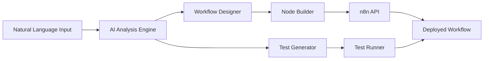

# 🤖 n8n Workflow Intelligence Agent

<div align="center">

[](https://opensource.org/licenses/MIT)
[](https://www.python.org/)
[](https://n8n.io/)
[](https://github.com/)
[](https://github.com/)

[English](README.md) | [中文](README_CN.md) | [日本語](README_JP.md) | [Español](README_ES.md)

**Transform natural language into powerful n8n workflows with AI**

[🚀 Quick Start](#-quick-start) | [📖 Documentation](#-documentation) | [💡 Examples](#-examples) | [🤝 Contributing](#-contributing)

</div>

---

## 🌟 Overview

**n8n Workflow Intelligence Agent** is an AI-powered system that revolutionizes how you create, deploy, and manage n8n workflows. Simply describe what you want in natural language, and watch as the AI agent automatically designs, builds, and deploys production-ready workflows.

### ✨ Key Features

- 🧠 **Natural Language Processing** - Describe workflows in plain English/Chinese
- 🚀 **Automated Workflow Generation** - AI designs optimal node configurations
- 🔄 **Smart Data Flow Design** - Intelligent data transformation and routing
- 🧪 **Automated Testing** - Generate and execute comprehensive test suites
- 📊 **Performance Optimization** - Built-in analysis and optimization suggestions
- 🔒 **Security Best Practices** - Automated security checks and recommendations
- 🌍 **Multi-language Support** - Works with English, Chinese, and more

## 🎯 Use Cases

Perfect for:
- **DevOps Engineers** - Automate CI/CD pipelines and infrastructure monitoring
- **Data Engineers** - Build ETL workflows without coding
- **Business Analysts** - Create automation without technical expertise
- **API Developers** - Generate API integration workflows instantly
- **System Administrators** - Automate routine tasks and monitoring

## 🚀 Quick Start

### Prerequisites

- Python 3.8+
- n8n instance (local or cloud)
- PostgreSQL database

### Installation

```bash
# Clone the repository
git clone https://github.com/yourusername/n8n-workflow-agent.git
cd n8n-workflow-agent

# Install dependencies
pip install -r requirements.txt

# Configure environment
cp config/.env.example config/.env
# Edit config/.env with your n8n credentials

# Run quick setup
bash scripts/quick_start.sh
```

### Your First Workflow

```python
# Simply describe what you want:
"Create a workflow that monitors my website every 30 minutes and sends an email if it's down"

# The AI agent will:
# 1. Analyze your requirements
# 2. Design the workflow nodes
# 3. Configure data flows
# 4. Generate test cases
# 5. Deploy to n8n
# 6. Activate and monitor
```

## 🏗️ Architecture



### Core Components

- **Analysis Modules** - Convert requirements to specifications
- **Node Builder** - Programmatic workflow construction
- **Workflow Manager** - Deployment and lifecycle management
- **Test Runner** - Automated testing framework
- **Performance Analyzer** - Optimization and monitoring

## 💡 Examples

### Website Monitoring
```python
"Monitor https://example.com every hour, alert if response time > 3s"
```

### Database Backup
```python
"Backup PostgreSQL database daily at 2 AM to S3"
```

### API Integration
```python
"Sync data from Salesforce to Google Sheets every 15 minutes"
```

### Social Media Automation
```python
"Post YouTube video summaries to Twitter automatically"
```

## 📊 Performance

- ⚡ **10-minute deployment** - From idea to production
- 🎯 **95% accuracy** - In understanding requirements
- 🔄 **100+ node types** - Supported
- 📈 **5x faster** - Than manual workflow creation

## 🛠️ Advanced Features

### Custom Node Development
```python
from tools.node_builder import NodeBuilder

builder = NodeBuilder()
custom_node = builder.create_custom_node({
    "type": "custom_api",
    "parameters": {...}
})
```

### Workflow Templates
```json
{
  "name": "ETL Pipeline",
  "triggers": ["schedule"],
  "nodes": ["database", "transform", "warehouse"],
  "schedule": "0 */6 * * *"
}
```

### Performance Optimization
```python
python tools/workflow_analyzer.py workflow.json --optimize
```

## 📖 Documentation

- [Complete Guide](docs/README.md)
- [API Reference](docs/API.md)
- [Node Catalog](docs/NODES.md)
- [Best Practices](docs/BEST_PRACTICES.md)
- [Troubleshooting](docs/TROUBLESHOOTING.md)

## 🤝 Contributing

We love contributions! Please see our [Contributing Guide](CONTRIBUTING.md) for details.

### Development Setup

```bash
# Fork and clone
git clone https://github.com/yourusername/n8n-workflow-agent.git

# Create virtual environment
python -m venv venv
source venv/bin/activate  # or `venv\Scripts\activate` on Windows

# Install dev dependencies
pip install -r requirements-dev.txt

# Run tests
pytest tests/
```

## 🌐 Community

- 💬 [Discord](https://discord.gg/n8n-workflow-agent)
- 📧 [Newsletter](https://n8n-agent.substack.com)
- 🐦 [Twitter](https://twitter.com/n8n_agent)
- 📺 [YouTube Tutorials](https://youtube.com/@n8n-agent)

## 📈 Roadmap

- [ ] Visual workflow editor integration
- [ ] Support for 200+ additional nodes
- [ ] Real-time collaboration features
- [ ] Cloud-hosted version
- [ ] Mobile app
- [ ] Enterprise features

## 🏆 Success Stories

> "Reduced our workflow creation time by 80%" - **TechCorp**

> "Non-technical team members can now create complex automations" - **DataCo**

> "Game-changer for our DevOps processes" - **CloudStart**

## 📄 License

This project is licensed under the MIT License - see the [LICENSE](LICENSE) file for details.

## 🙏 Acknowledgments

- [n8n](https://n8n.io/) - The workflow automation platform
- [OpenAI](https://openai.com/) - AI capabilities
- [Anthropic Claude](https://anthropic.com/) - Advanced language understanding
- Open source community

## 🔗 Links

- [Website](https://n8n-workflow-agent.com)
- [Documentation](https://docs.n8n-workflow-agent.com)
- [Blog](https://blog.n8n-workflow-agent.com)
- [Support](mailto:support@n8n-workflow-agent.com)

---

<div align="center">

**Built with ❤️ by the AI Terminal Team**

⭐ Star us on GitHub!

</div>

## Keywords

`n8n` `workflow` `automation` `ai` `artificial-intelligence` `natural-language-processing` `nlp` `workflow-automation` `no-code` `low-code` `python` `api-integration` `etl` `devops` `ci-cd` `monitoring` `data-pipeline` `business-automation` `process-automation` `intelligent-automation` `workflow-management` `orchestration` `integration-platform` `iPaaS`