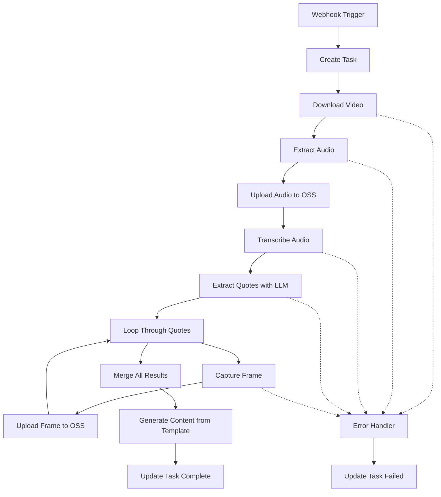

# YouTube2Post n8n Workflow Design

## 🎯 Workflow Overview

将YouTube视频自动转换为结构化的图文内容，包含金句提取、时间戳、截图生成。

## 📋 Requirements Analysis

### Input
- YouTube视频URL
- 可选参数：
  - 目标语言 (zh-CN, en, etc.)
  - 金句数量 (3-5条)
  - 截图数量

### Output
- 结构化JSON包含：
  - 视频元信息（标题、作者、时长）
  - 金句列表（文本、时间戳、配图URL）
  - 生成的图文内容HTML
  - 所有资源的OSS链接

## 🔧 Node Design

### 1. Webhook Trigger Node
```json
{
  "type": "webhook",
  "parameters": {
    "path": "/youtube2post",
    "method": "POST",
    "responseMode": "lastNode"
  }
}
```

### 2. Task Creation Node (HTTP Request)
```json
{
  "type": "httpRequest",
  "name": "Create Task",
  "parameters": {
    "method": "POST",
    "url": "={{$env.BACKEND_URL}}/api/tasks",
    "body": {
      "url": "={{$json.youtube_url}}",
      "language": "={{$json.language || 'zh-CN'}}",
      "status": "queued"
    }
  }
}
```

### 3. Video Download Node (Execute Command)
```json
{
  "type": "executeCommand",
  "name": "Download Video",
  "parameters": {
    "command": "yt-dlp",
    "arguments": [
      "--output", "/tmp/{{$json.taskId}}.mp4",
      "--format", "best[ext=mp4]/best",
      "{{$json.youtube_url}}"
    ]
  }
}
```

### 4. Extract Audio Node (Execute Command)
```json
{
  "type": "executeCommand",
  "name": "Extract Audio",
  "parameters": {
    "command": "ffmpeg",
    "arguments": [
      "-i", "/tmp/{{$json.taskId}}.mp4",
      "-vn", "-acodec", "pcm_s16le",
      "-ar", "16000",
      "/tmp/{{$json.taskId}}.wav"
    ]
  }
}
```

### 5. Upload to OSS Node (HTTP Request)
```json
{
  "type": "httpRequest",
  "name": "Upload to OSS",
  "parameters": {
    "method": "POST",
    "url": "={{$env.OSS_UPLOAD_URL}}",
    "headers": {
      "Authorization": "Bearer {{$credentials.oss.token}}"
    },
    "sendBinaryData": true,
    "binaryPropertyName": "data"
  }
}
```

### 6. Transcribe Audio Node (HTTP Request)
```json
{
  "type": "httpRequest",
  "name": "Transcribe Audio",
  "parameters": {
    "method": "POST",
    "url": "={{$env.SENSEVOICE_API_URL}}/transcribe",
    "body": {
      "audio_url": "={{$json.oss_audio_url}}",
      "language": "={{$json.language}}",
      "output_format": "json_with_timestamps"
    }
  }
}
```

### 7. Extract Quotes Node (HTTP Request)
```json
{
  "type": "httpRequest",
  "name": "Extract Quotes",
  "parameters": {
    "method": "POST",
    "url": "={{$env.LLM_API_URL}}/chat",
    "headers": {
      "Authorization": "Bearer {{$credentials.dashscope.apiKey}}"
    },
    "body": {
      "model": "qwen-max",
      "messages": [
        {
          "role": "system",
          "content": "你是一个专业的内容编辑。从以下转写文本中提取3-5条最有价值的金句。每条金句应该：\n1. 独立完整，有观点或洞察\n2. 控制在20-50字\n3. 保留原始时间戳\n\n输出JSON格式：\n[\n  {\n    \"text\": \"金句内容\",\n    \"timestamp\": \"00:01:23\",\n    \"start_seconds\": 83\n  }\n]"
        },
        {
          "role": "user",
          "content": "{{$json.transcription}}"
        }
      ]
    }
  }
}
```

### 8. Loop Through Quotes (Split In Batches)
```json
{
  "type": "splitInBatches",
  "name": "Process Each Quote",
  "parameters": {
    "batchSize": 1,
    "options": {}
  }
}
```

### 9. Capture Frame Node (Execute Command)
```json
{
  "type": "executeCommand",
  "name": "Capture Frame",
  "parameters": {
    "command": "ffmpeg",
    "arguments": [
      "-ss", "{{$json.start_seconds}}",
      "-i", "/tmp/{{$json.taskId}}.mp4",
      "-frames:v", "1",
      "-q:v", "2",
      "/tmp/{{$json.taskId}}_quote_{{$itemIndex}}.jpg"
    ]
  }
}
```

### 10. Upload Frame to OSS (HTTP Request)
```json
{
  "type": "httpRequest",
  "name": "Upload Frame",
  "parameters": {
    "method": "POST",
    "url": "={{$env.OSS_UPLOAD_URL}}",
    "sendBinaryData": true,
    "binaryPropertyName": "image"
  }
}
```

### 11. Merge Results Node
```json
{
  "type": "merge",
  "name": "Merge All Data",
  "parameters": {
    "mode": "combine",
    "combinationMode": "mergeByPosition"
  }
}
```

### 12. Generate Content Node (HTTP Request)
```json
{
  "type": "httpRequest",
  "name": "Generate Content",
  "parameters": {
    "method": "POST",
    "url": "={{$env.TEMPLATE_API_URL}}/generate",
    "body": {
      "template": "youtube2post",
      "data": {
        "video": "={{$json.video_metadata}}",
        "quotes": "={{$json.quotes_with_images}}",
        "oss_urls": "={{$json.all_oss_urls}}"
      }
    }
  }
}
```

### 13. Update Task Status (HTTP Request)
```json
{
  "type": "httpRequest",
  "name": "Update Task Complete",
  "parameters": {
    "method": "PATCH",
    "url": "={{$env.BACKEND_URL}}/api/tasks/{{$json.taskId}}",
    "body": {
      "status": "completed",
      "result": "={{$json}}",
      "completedAt": "={{$now}}"
    }
  }
}
```

### 14. Error Handler Node (Error Trigger)
```json
{
  "type": "errorTrigger",
  "name": "Handle Errors",
  "parameters": {}
}
```

### 15. Update Error Status (HTTP Request)
```json
{
  "type": "httpRequest",
  "name": "Update Task Failed",
  "parameters": {
    "method": "PATCH",
    "url": "={{$env.BACKEND_URL}}/api/tasks/{{$json.taskId}}",
    "body": {
      "status": "failed",
      "error": "={{$json.error}}",
      "failedAt": "={{$now}}"
    }
  }
}
```

## 📊 Data Flow



## 🧪 Test Scenarios

### Test Case 1: Happy Path
```json
{
  "input": {
    "youtube_url": "https://youtu.be/bJFtcwLSNxI",
    "language": "zh-CN"
  },
  "expected": {
    "status": "completed",
    "quotes_count": 3,
    "has_images": true,
    "has_content": true
  }
}
```

### Test Case 2: Invalid URL
```json
{
  "input": {
    "youtube_url": "https://invalid-url.com/video",
    "language": "en"
  },
  "expected": {
    "status": "failed",
    "error_contains": "download failed"
  }
}
```

### Test Case 3: Transcription Failure
```json
{
  "input": {
    "youtube_url": "https://youtu.be/test-no-audio",
    "language": "zh-CN"
  },
  "expected": {
    "status": "failed",
    "error_contains": "transcription failed"
  }
}
```

## 🔧 Environment Variables Required

```env
# Backend API
BACKEND_URL=http://localhost:6000

# OSS Configuration
OSS_UPLOAD_URL=https://oss.aliyuncs.com/upload
OSS_ACCESS_KEY=your_access_key
OSS_SECRET_KEY=your_secret_key
OSS_BUCKET=youtube2post-bucket

# SenseVoice API
SENSEVOICE_API_URL=https://api.sensevoice.com

# LLM Configuration
LLM_API_URL=https://dashscope.aliyuncs.com/api/v1
DASHSCOPE_API_KEY=sk-xxxxxxxxxxxx

# Template Service
TEMPLATE_API_URL=http://localhost:6000/api/generate

# File Paths
TEMP_DIR=/tmp/youtube2post
```

## 🚀 Deployment Steps

1. **Install Dependencies**
   ```bash
   # Install system tools
   apt-get update && apt-get install -y ffmpeg
   pip3 install yt-dlp
   ```

2. **Configure Credentials in n8n**
   - Add OSS credentials
   - Add DashScope API key
   - Configure webhook authentication

3. **Import Workflow**
   ```bash
   python tools/n8n_workflow_manager.py create youtube2post_workflow.json --activate
   ```

4. **Test Workflow**
   ```bash
   curl -X POST http://your-n8n:5679/webhook/youtube2post \
     -H "Content-Type: application/json" \
     -d '{"youtube_url": "https://youtu.be/test-video", "language": "zh-CN"}'
   ```

## 🎯 Performance Optimization

1. **Parallel Processing**
   - Download video and prepare OSS bucket in parallel
   - Process multiple quotes simultaneously

2. **Caching**
   - Cache transcription results for same video
   - Reuse extracted frames for repeated requests

3. **Resource Management**
   - Clean up temp files after processing
   - Limit concurrent workflow executions
   - Set timeouts for each node

## 📝 Notes

- Total estimated execution time: 5-10 minutes per video
- Maximum video length: 30 minutes (configurable)
- Supported languages: zh-CN, en, ja, ko, es
- Output formats: JSON, HTML, Markdown